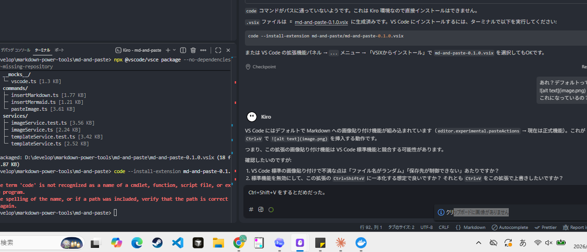

## 抱えていた問題点

### 1. Markdown編集が不便

* 画像をそのまま **Ctrl+V** で貼れない
* 貼れても、画像ファイル名や保存場所を自分の思う形で制御しにくい
* Markdown構文を毎回手で打つのが面倒
* Mermaid構文もすぐ呼び出せず、雛形作成が手間

### 2. 既存ツールが「近いけど足りない」

* VS Code拡張やMarkdownエディタには近い機能はある
* ただし、

  * 画像保存時の命名規則
  * 保存先の柔軟性
  * 自分向けのMarkdown/Mermaidテンプレ呼び出し
    までちょうどよく満たすものがない

### 3. 自分向け作り込みの余地がある

* 毎回使う操作なので、小さい不便でも積み重なる
* 汎用品に合わせるより、自分の運用に合わせたほうが効率がよい

---

## 解決策

### 1. VS Code用の自分専用拡張を作る

目的は、Markdown作業の定型操作を自動化すること。

### 2. まずは最小機能に絞る

最初から全部入りにせず、価値の高い部分から作る。

#### 最優先

**画像貼り付け機能**

* Markdown上で画像を貼る
* 画像を自動保存する
* Markdownの画像リンクを自動挿入する
* Ctrl+V

例:

* 保存先: `assets/`
* ファイル名: `20260311-213045.png`

#### 次点

**Markdownテンプレ挿入**

* table
* code block
* checklist
* details
* quote など

#### その次

**Mermaidテンプレ挿入**

* flowchart
* sequence
* er
* state など

### 4. 公開用ではなく自分用として割り切る

* 汎用化しようとすると面倒が増える
* 自分専用なら必要な仕様だけ実装すればよい
* 費用対効果が高い

---

## 要するに

**「Markdownを書くたびに発生する小さな不便が多い」**

ことです。

解決策は、

**「VS Code用の小さな自作拡張を作り、画像貼り付けと構文テンプレ挿入を自動化すること」**

です。

